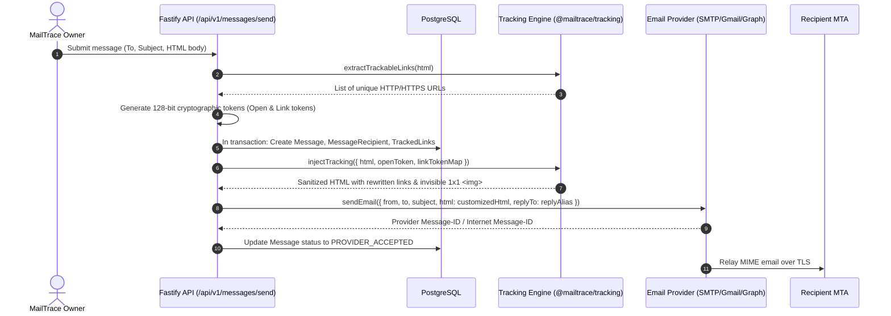
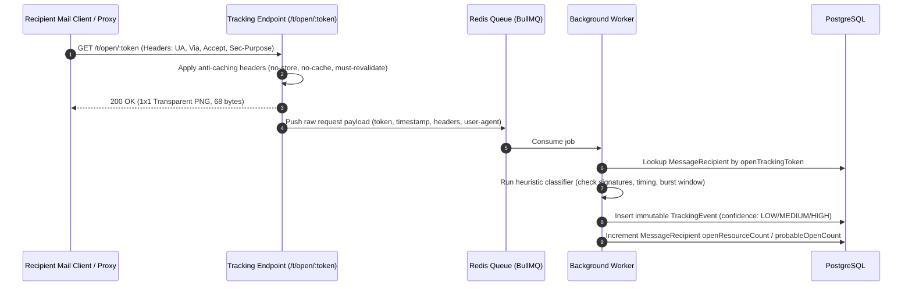
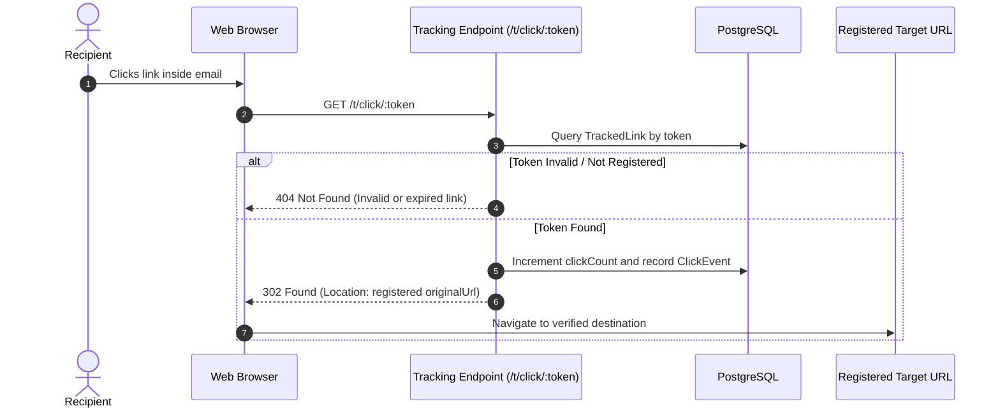
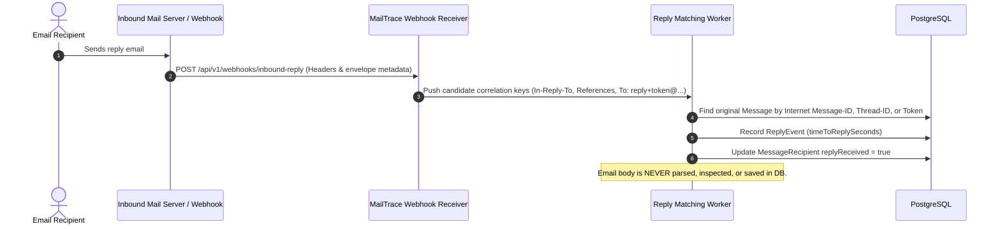
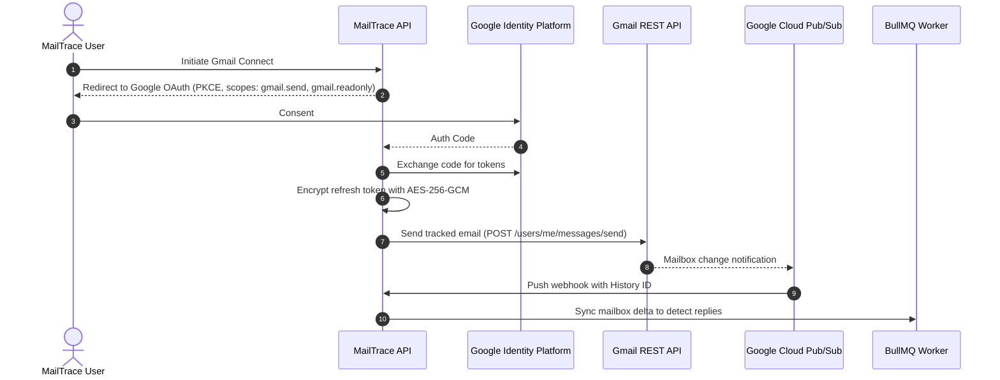
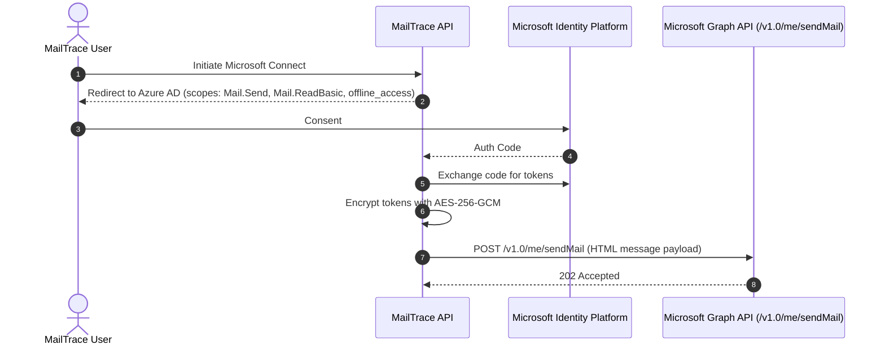
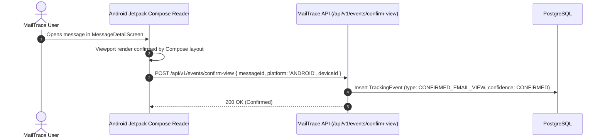
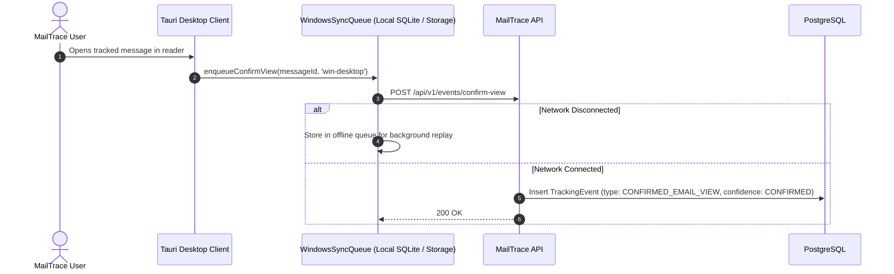

# MailTrace Technical Architecture

This document details the architectural design, component relationships, data flow, and telemetry invariants of **MailTrace**.

---

## 1. Core Architectural Diagrams

### Diagram 1: Email Sending Workflow



---

### Diagram 2: Tracking Pixel Request & Header Inspection



---

### Diagram 3: Click Tracking & Strict Open-Redirect Protection



---

### Diagram 4: Reply Association Pipeline



---

### Diagram 5: Gmail Integration & Push Sync



---

### Diagram 6: Microsoft Graph Integration



---

### Diagram 7: Android First-Party Confirmation



---

### Diagram 8: Windows First-Party Confirmation



---

### Diagram 9: Anti-False-Positive Event Processing Pipeline

```mermaid
flowchart TD
    RAW[Raw HTTP Request Received at /t/open/:token] --> HEADERS[Extract Headers, User-Agent, Timing]
    HEADERS --> CHECK_1{Is First-Party Verified?}
    CHECK_1 -- Yes --> CONFIRMED[CONFIRMED_EMAIL_VIEW\nConfidence: CONFIRMED (1.0)]
    CHECK_1 -- No --> CHECK_2{Prefetch Header Present?}
    CHECK_2 -- Yes --> AUTOMATED_1[TRACKING_RESOURCE_REQUESTED\nClassification: LIKELY_AUTOMATED\nConfidence: LOW]
    CHECK_2 -- No --> CHECK_3{Matches Security Scanner\nProofpoint / Barracuda / Bot?}
    CHECK_3 -- Yes --> AUTOMATED_2[TRACKING_RESOURCE_REQUESTED\nClassification: LIKELY_AUTOMATED\nConfidence: LOW]
    CHECK_3 -- No --> CHECK_4{Matches Caching Proxy\nGoogleImageProxy / Apple MPP?}
    CHECK_4 -- Yes --> PROXY[POSSIBLE_EMAIL_OPEN\nClassification: POSSIBLE_HUMAN\nConfidence: MEDIUM]
    CHECK_4 -- No --> CHECK_5{Time since dispatch < 1.0s?}
    CHECK_5 -- Yes --> AUTOMATED_3[TRACKING_RESOURCE_REQUESTED\nClassification: LIKELY_AUTOMATED\nConfidence: LOW]
    CHECK_5 -- No --> PROBABLE[PROBABLE_EMAIL_OPEN\nClassification: PROBABLE_HUMAN\nConfidence: HIGH]

    CONFIRMED --> DEDUP[Window Burst Deduplication (3s)]
    AUTOMATED_1 --> DEDUP
    AUTOMATED_2 --> DEDUP
    AUTOMATED_3 --> DEDUP
    PROXY --> DEDUP
    PROBABLE --> DEDUP

    DEDUP --> DB[(PostgreSQL Immutable Event Store)]
```

---

## 2. Invariants & Guarantees

1. **Passive Tracking != Confirmed Read:** Passive tracking is always modeled as an empirical evidence stream, never absolute certainty.
2. **Immutable Event History:** Every raw telemetry event is stored with its source and diagnostics. Aggregates are derived dynamically.
3. **Open-Redirect Immune:** Every URL passed through `/t/click/:token` is resolved exclusively via internal database primary records.
4. **Data Minimization:** No raw IP addresses stored by default. No recipient email bodies stored during reply tracking.
