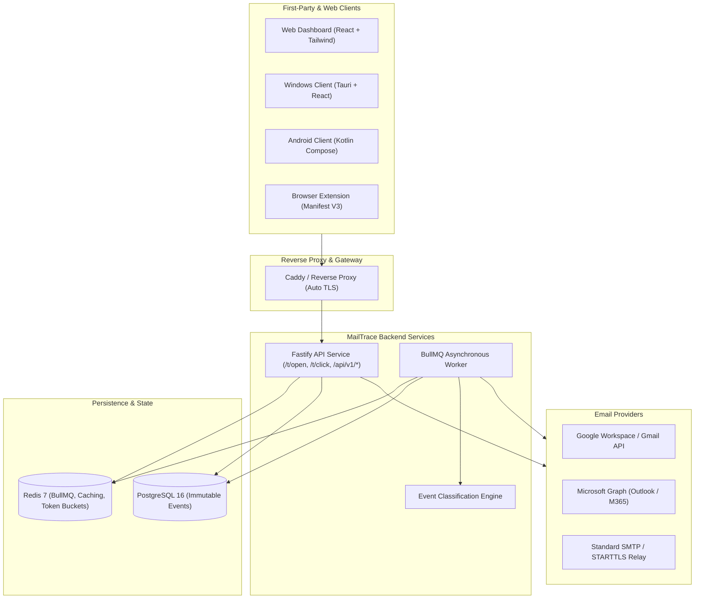
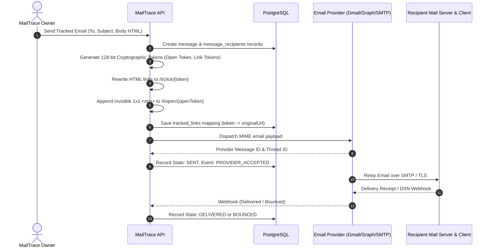
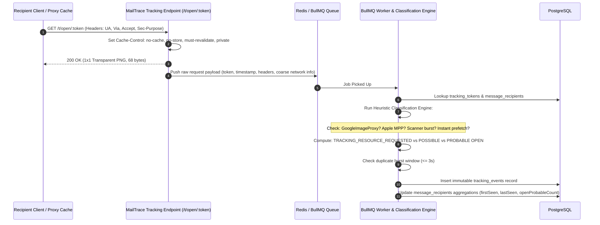
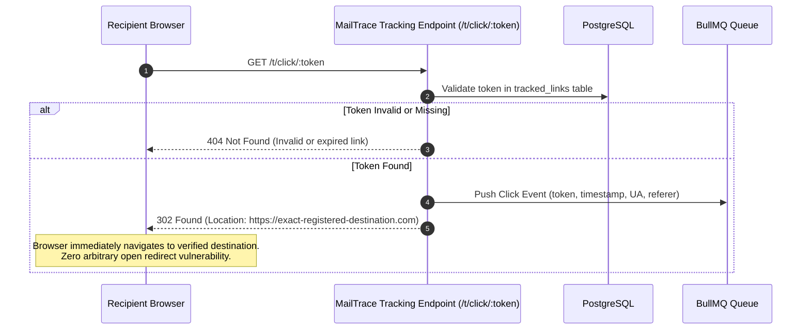
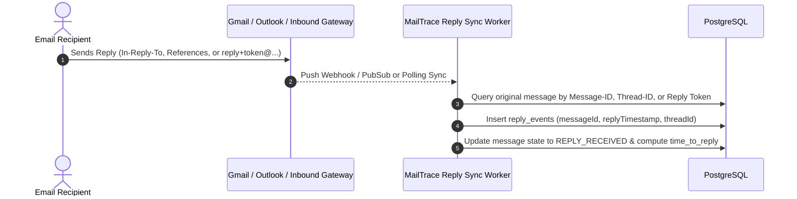
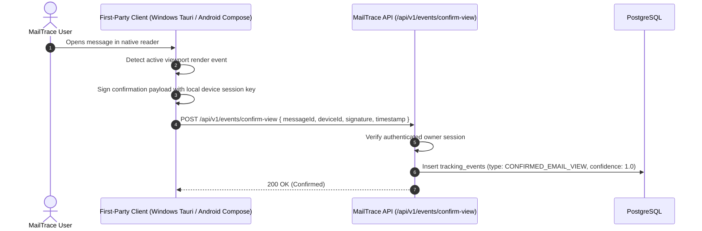

# MailTrace: Production-Quality Personal Email Tracking Platform Implementation Plan

> **For Claude:** REQUIRED SUB-SKILL: Use superpowers:executing-plans to implement this plan task-by-task.

**Goal:** Build a production-grade, open-source personal email tracking platform named **MailTrace** with privacy-first evidence classification, first-party confirmation, and zero false claims of passive "read" status.

**Architecture:** Monorepo architecture containing Fastify TypeScript API, BullMQ Redis workers, PostgreSQL with Prisma ORM, a Vite+React web dashboard, a Tauri Windows client, a Jetpack Compose Android client, and an optional Manifest V3 browser extension. Email dispatch is handled via a provider-agnostic abstraction (Gmail OAuth, Microsoft Graph, SMTP) with an immutable event stream, anti-false-positive heuristic engine, and cryptographic token tracking.

**Tech Stack:** Node.js 20+, TypeScript 5+, Fastify, PostgreSQL 16, Prisma ORM, Redis 7, BullMQ, React 18, Tailwind CSS, Recharts, Tauri 2.0, Kotlin, Jetpack Compose, Docker Compose, Caddy.

---

## Executive Summary & Design Principles

1. **Evidence-Based Classification, Never False Read Claims:** A passive HTTP GET for a tracking pixel is evidence only that a remote resource was fetched. MailTrace strictly models this as `TRACKING_RESOURCE_REQUESTED`, analyzes timing, proxy signatures, and user agents to derive `POSSIBLE_EMAIL_OPEN` or `PROBABLE_EMAIL_OPEN`, and reserves `CONFIRMED_EMAIL_VIEW` exclusively for verified first-party clients.
2. **Strict Invisibility & Standards Compliance:** 1x1 transparent PNG/GIF, no tracking banners, no alteration of email layout, zero JavaScript inside emails, and no exploitation of security loopholes.
3. **Open Redirect & Replay Protection:** Link tracking tokens are cryptographically bound to specific registered URLs; arbitrary query-string redirects are mathematically prohibited.
4. **Privacy by Default:** Raw IP addresses are NOT stored by default. Only coarse network data (ASN/provider type) is retained if explicitly configured. All provider OAuth tokens are encrypted at rest using AES-256-GCM.
5. **Multi-Platform First-Party Ecosystem:** While third-party mail clients only provide passive signals, MailTrace's own Windows and Android apps emit cryptographically signed `FIRST_PARTY_VIEW_CONFIRMED` signals when the owner views messages.

---

## Architecture Diagrams

### 1. High-Level System Architecture



### 2. Email Sending, Tracking Injection & Delivery Pipeline



### 3. Open Tracking, Anti-False-Positive Classification & Deduplication



### 4. Link Click Tracking with Strict Open-Redirect Protection



### 5. Inbound Reply Tracking Pipeline



### 6. First-Party Confirmed View Flow (Windows & Android Clients)



---

## Monorepo Directory Layout

```
mailtrace/
├── apps/
│   ├── web/                    # React 18, Vite, Tailwind CSS, Recharts
│   ├── windows/                # Tauri 2.0 + React + TypeScript desktop client
│   ├── android/                # Native Android Kotlin + Jetpack Compose app
│   └── extension/              # Manifest V3 browser extension for Gmail/Outlook webmail
├── services/
│   ├── api/                    # Fastify API (tracking endpoints, REST API, auth)
│   └── worker/                 # BullMQ background worker (event classification, email sync)
├── packages/
│   ├── shared/                 # Zod schemas, TypeScript types, confidence models, constants
│   ├── database/               # Prisma schema, migrations, seed, repository helpers
│   ├── tracking/               # Tracking pixel, token generator, HTML link rewriter
│   ├── email/                  # EmailProvider abstraction: Gmail, Microsoft Graph, SMTP
│   └── analytics/              # Aggregation engine, metric calculation, heuristic classifier
├── docs/                       # Architectural docs, threat models, API specs, diagrams
│   ├── ARCHITECTURE.md
│   ├── THREAT_MODEL.md
│   ├── PRIVACY.md
│   ├── API.md
│   ├── SELF_HOSTING.md
│   ├── SECURITY.md
│   └── plans/
│       └── 2026-09-28-mailtrace-implementation-plan.md
├── infrastructure/
│   ├── docker-compose.yml      # Local and self-hosted orchestration
│   ├── docker-compose.prod.yml # Production setup with Caddy
│   ├── Caddyfile               # Automatic HTTPS reverse proxy config
│   ├── Dockerfile.api
│   ├── Dockerfile.worker
│   ├── Dockerfile.web
│   └── .env.example
├── pnpm-workspace.yaml
├── package.json
├── turbo.json
└── tsconfig.base.json
```

---

## Detailed Database Schema Design (PostgreSQL + Prisma)

```prisma
datasource db {
  provider = "postgresql"
  url      = env("DATABASE_URL")
}

generator client {
  provider = "prisma-client-js"
}

enum AccountProvider {
  GMAIL
  MICROSOFT
  SMTP
}

enum MessageStatus {
  DRAFT
  PENDING
  SENT
  PROVIDER_ACCEPTED
  DELIVERED
  BOUNCED
  FAILED
}

enum TokenType {
  OPEN_TRACKING
  LINK_TRACKING
  REPLY_ALIAS
}

enum TrackingEventType {
  TRACKING_RESOURCE_REQUESTED
  POSSIBLE_EMAIL_OPEN
  PROBABLE_EMAIL_OPEN
  CONFIRMED_EMAIL_VIEW
  LINK_CLICKED
  REPLY_RECEIVED
  DELIVERY_STATUS_UPDATED
}

enum ConfidenceLevel {
  LOW           // e.g. Single automated prefetch / proxy fetch
  MEDIUM        // e.g. Google Image Proxy or delayed request with standard UA
  HIGH          // e.g. Interactive timing + subsequent link click
  CONFIRMED     // e.g. First-party native reader direct report
}

enum Classification {
  UNDETERMINED
  LIKELY_AUTOMATED
  POSSIBLE_HUMAN
  PROBABLE_HUMAN
  CONFIRMED_FIRST_PARTY
}

model User {
  id               String          @id @default(uuid())
  email            String          @unique
  passwordHash     String?         // Nullable for OAuth-only users
  displayName      String?
  privacySettings  Json            @default("{\"storeRawIp\":false,\"retainCoarseGeo\":true,\"eventRetentionDays\":90}")
  createdAt        DateTime        @default(now())
  updatedAt        DateTime        @updatedAt
  accounts         Account[]
  messages         Message[]
  deviceSessions   DeviceSession[]
  auditLogs        AuditLog[]

  @@map("users")
}

model Account {
  id                     String          @id @default(uuid())
  userId                 String
  user                   User            @relation(fields: [userId], references: [id], onDelete: Cascade)
  provider               AccountProvider
  emailAddress           String
  displayName            String?
  encryptedCredentials   String          // AES-256-GCM encrypted tokens or SMTP passwords
  providerAccountId      String?
  isDefault              Boolean         @default(false)
  syncCursor             String?
  createdAt              DateTime        @default(now())
  updatedAt              DateTime        @updatedAt
  messages               Message[]

  @@unique([userId, emailAddress, provider])
  @@map("accounts")
}

model Message {
  id                   String              @id @default(uuid())
  userId               String
  user                 User                @relation(fields: [userId], references: [id], onDelete: Cascade)
  accountId            String
  account              Account             @relation(fields: [accountId], references: [id], onDelete: Restrict)
  subject              String
  threadId             String?
  providerMessageId    String?             @unique
  internetMessageId    String?             @unique // RFC 2822 Message-ID
  status               MessageStatus       @default(DRAFT)
  sentAt               DateTime?
  deliveredAt          DateTime?
  firstActivityAt      DateTime?
  lastActivityAt       DateTime?
  createdAt            DateTime            @default(now())
  updatedAt            DateTime            @updatedAt

  recipients           MessageRecipient[]
  trackedLinks         TrackedLink[]
  trackingEvents       TrackingEvent[]
  replyEvents          ReplyEvent[]
  deliveryEvents       DeliveryEvent[]

  @@index([userId, sentAt])
  @@index([threadId])
  @@index([internetMessageId])
  @@map("messages")
}

model Recipient {
  id               String              @id @default(uuid())
  email            String              @unique
  name             String?
  company          String?
  createdAt        DateTime            @default(now())
  updatedAt        DateTime            @updatedAt
  messageRecipients MessageRecipient[]

  @@index([email])
  @@map("recipients")
}

model MessageRecipient {
  id                   String          @id @default(uuid())
  messageId            String
  message              Message         @relation(fields: [messageId], references: [id], onDelete: Cascade)
  recipientId          String
  recipient            Recipient       @relation(fields: [recipientId], references: [id], onDelete: Cascade)
  openTrackingToken    String          @unique // Cryptographic 128-bit+ token
  replyAliasToken      String?         @unique // reply+<token>@domain.com
  openResourceCount    Int             @default(0)
  probableOpenCount    Int             @default(0)
  confirmedViewCount   Int             @default(0)
  totalClicks          Int             @default(0)
  uniqueClicks         Int             @default(0)
  replyReceived        Boolean         @default(false)
  deliveryStatus       MessageStatus   @default(PENDING)
  createdAt            DateTime        @default(now())
  updatedAt            DateTime        @updatedAt

  trackingEvents       TrackingEvent[]

  @@unique([messageId, recipientId])
  @@index([openTrackingToken])
  @@map("message_recipients")
}

model TrackingToken {
  id             String       @id @default(uuid())
  token          String       @unique // 128-bit+ cryptographically secure token
  type           TokenType
  messageId      String
  recipientId    String?
  linkId         String?      // References TrackedLink if type == LINK_TRACKING
  expiresAt      DateTime?
  createdAt      DateTime     @default(now())

  @@index([token, type])
  @@map("tracking_tokens")
}

model TrackedLink {
  id             String          @id @default(uuid())
  messageId      String
  message        Message         @relation(fields: [messageId], references: [id], onDelete: Cascade)
  token          String          @unique // Token used in /t/click/:token
  originalUrl    String          // Strict redirection target, open-redirect prevention
  clickCount     Int             @default(0)
  uniqueClicks   Int             @default(0)
  createdAt      DateTime        @default(now())
  updatedAt      DateTime        @updatedAt

  clickEvents    ClickEvent[]

  @@index([token])
  @@map("tracked_links")
}

model TrackingEvent {
  id                   String              @id @default(uuid())
  messageId            String
  message              Message             @relation(fields: [messageId], references: [id], onDelete: Cascade)
  messageRecipientId   String?
  messageRecipient     MessageRecipient?   @relation(fields: [messageRecipientId], references: [id], onDelete: SetNull)
  type                 TrackingEventType
  confidence           ConfidenceLevel     @default(LOW)
  classification       Classification      @default(UNDETERMINED)
  timestamp            DateTime            @default(now())
  source               String              // "http_get", "first_party_windows", "first_party_android", "gmail_webhook"
  userAgent            String?
  isProxy              Boolean             @default(false)
  proxyType            String?             // "GOOGLE_IMAGE_PROXY", "APPLE_MPP", "OFFICE365", "UNKNOWN"
  isBurstDuplicate     Boolean             @default(false)
  rawHeaders           Json?               // Diagnostic request headers
  coarseLocation       Json?               // ASN, country, city (only if enabled in privacy settings)
  metadata             Json?

  clickEvent           ClickEvent?

  @@index([messageId, timestamp])
  @@index([type])
  @@index([timestamp])
  @@map("tracking_events")
}

model ClickEvent {
  id                 String          @id @default(uuid())
  trackingEventId    String          @unique
  trackingEvent      TrackingEvent   @relation(fields: [trackingEventId], references: [id], onDelete: Cascade)
  trackedLinkId      String
  trackedLink        TrackedLink     @relation(fields: [trackedLinkId], references: [id], onDelete: Cascade)
  isUnique           Boolean         @default(true)
  timestamp          DateTime        @default(now())

  @@index([trackedLinkId, timestamp])
  @@map("click_events")
}

model ReplyEvent {
  id                 String          @id @default(uuid())
  messageId          String
  message            Message         @relation(fields: [messageId], references: [id], onDelete: Cascade)
  providerReplyId    String?
  replyThreadId      String?
  replyTimestamp     DateTime        @default(now())
  timeToReplySeconds Int?
  createdAt          DateTime        @default(now())

  @@index([messageId])
  @@map("reply_events")
}

model DeliveryEvent {
  id                 String          @id @default(uuid())
  messageId          String
  message            Message         @relation(fields: [messageId], references: [id], onDelete: Cascade)
  status             MessageStatus
  reason             String?
  rawPayload         Json?
  timestamp          DateTime        @default(now())

  @@index([messageId, timestamp])
  @@map("delivery_events")
}

model DeviceSession {
  id                 String          @id @default(uuid())
  userId             String
  user               User            @relation(fields: [userId], references: [id], onDelete: Cascade)
  platform           String          // "WINDOWS", "ANDROID", "WEB", "EXTENSION"
  deviceIdentifier   String
  publicKey          String?         // Used for signed confirmation events
  lastSyncAt         DateTime        @default(now())
  createdAt          DateTime        @default(now())

  @@unique([userId, deviceIdentifier])
  @@map("device_sessions")
}

model AuditLog {
  id                 String          @id @default(uuid())
  userId             String?
  user               User?           @relation(fields: [userId], references: [id], onDelete: SetNull)
  action             String
  resourceType       String
  resourceId         String?
  ipAddress          String?         // Hash or masked if privacy mode is ON
  userAgent          String?
  timestamp          DateTime        @default(now())

  @@index([userId, timestamp])
  @@map("audit_logs")
}
```

---

## 10-Phase Implementation Roadmap

```mermaid
gantt
    title MailTrace Phased Implementation Roadmap
    dateFormat  YYYY-MM-DD
    section Core Foundation
    Phase 1: Backend, DB, Tracking & SMTP     :active, p1, 2026-10-01, 7d
    Phase 2: React Dashboard & Timeline       :p2, after p1, 6d
    section Provider Ecosystem
    Phase 3: Gmail OAuth & Webhook Sync       :p3, after p2, 5d
    Phase 4: Microsoft Graph & Outlook 365    :p4, after p3, 5d
    section Intelligence & Pipelines
    Phase 5: Inbound Reply & Delivery Pipeline:p5, after p4, 5d
    Phase 6: Anti-False-Positive Engine       :p6, after p5, 5d
    section Native Clients
    Phase 7: Windows Tauri First-Party App    :p7, after p6, 6d
    Phase 8: Android Compose First-Party App  :p8, after p7, 6d
    Phase 9: Webmail Browser Extension        :p9, after p8, 4d
    section Production Readiness
    Phase 10: Security, E2E Tests, Docker     :p10, after p9, 5d
```

---

### Phase 1: Backend Foundation, Database, Tracking Engine & SMTP Provider

#### Task 1.1: Monorepo Scaffolding & Shared Types
- **Files:**
  - Create: `package.json`, `pnpm-workspace.yaml`, `turbo.json`, `tsconfig.base.json`
  - Create: `packages/shared/package.json`, `packages/shared/src/index.ts`, `packages/shared/src/types/index.ts`, `packages/shared/src/schemas/index.ts`
- **Steps:**
  1. Write failing test for shared Zod schema validation (`messageSendSchema`, `trackingEventSchema`).
  2. Implement Zod validation schemas and TypeScript types.
  3. Verify typecheck and tests pass with `pnpm --filter @mailtrace/shared test`.

#### Task 1.2: Prisma Database Setup & AES-256-GCM Encryption Utilities
- **Files:**
  - Create: `packages/database/prisma/schema.prisma`
  - Create: `packages/database/src/client.ts`
  - Create: `packages/database/src/crypto.ts`
  - Test: `packages/database/src/__tests__/crypto.test.ts`
- **Steps:**
  1. Write test for `encryptToken(plainText, key)` and `decryptToken(cipherText, key)` using AES-256-GCM with authenticated tags and unique IVs.
  2. Implement crypto helpers in `packages/database/src/crypto.ts`.
  3. Run Prisma migration generate (`prisma generate`).
  4. Verify all tests pass.

#### Task 1.3: Tracking Engine Package (Pixel & HTML Link Rewriter)
- **Files:**
  - Create: `packages/tracking/src/pixel.ts` (Valid 1x1 transparent PNG binary buffer, 68 bytes)
  - Create: `packages/tracking/src/token.ts` (Cryptographically secure random base62/hex 128-bit generator)
  - Create: `packages/tracking/src/rewriter.ts` (HTML link rewriter & tracking pixel injector)
  - Test: `packages/tracking/src/__tests__/rewriter.test.ts`
- **Steps:**
  1. Write tests verifying that:
     - All `<a>` tags with `href` are rewritten to `${trackingBaseUrl}/t/click/${token}` without touching inner text or styling.
     - Tracking pixel `` is appended before `</body>`.
     - Injected pixel does not disrupt mail client CSS.
     - Emails without `</body>` gracefully append pixel at the very end.
  2. Implement rewriter using `cheerio` or `htmlparser2`.
  3. Verify tests pass.

#### Task 1.4: EmailProvider Abstraction & SMTP Provider
- **Files:**
  - Create: `packages/email/src/provider.interface.ts`
  - Create: `packages/email/src/providers/smtp.provider.ts`
  - Test: `packages/email/src/__tests__/smtp.provider.test.ts`
- **Steps:**
  1. Define `EmailProvider` interface: `sendEmail(payload)`, `verifyCredentials()`, `getDeliveryStatus(providerMessageId)`.
  2. Implement `SMTPProvider` using `nodemailer` supporting TLS, STARTTLS, DKIM, and SPF header preservation.
  3. Mock nodemailer and test connection verification and outbound message dispatch.

#### Task 1.5: Fastify API Core & Tracking Endpoints
- **Files:**
  - Create: `services/api/src/server.ts`, `services/api/src/app.ts`
  - Create: `services/api/src/routes/tracking.routes.ts` (`GET /t/open/:token`, `GET /t/click/:token`)
  - Create: `services/api/src/routes/auth.routes.ts`, `services/api/src/routes/messages.routes.ts`
  - Create: `services/api/src/plugins/security.ts` (Helmet, CORS, rate-limiting)
  - Test: `services/api/src/__tests__/tracking.routes.test.ts`
- **Steps:**
  1. Write failing integration tests for:
     - `GET /t/open/:token`: Returns status 200, Content-Type `image/png`, Cache-Control `private, no-cache, no-store, must-revalidate`, body matching 1x1 PNG.
     - `GET /t/click/:token`: Returns status 302, Location matching original registered destination URL.
     - Unregistered token returns 404. Open-redirect attack returns 404 or rejects.
  2. Implement endpoints in Fastify, dispatching raw events to Redis BullMQ queue `email-tracking-queue`.
  3. Run tests with `pnpm --filter @mailtrace/api test` and verify PASS.

#### Task 1.6: BullMQ Worker & Event Persistence
- **Files:**
  - Create: `services/worker/src/index.ts`
  - Create: `services/worker/src/processors/tracking-event.processor.ts`
  - Test: `services/worker/src/__tests__/tracking-event.processor.test.ts`
- **Steps:**
  1. Write tests verifying that raw tracking queue jobs are processed, matched with `message_recipients`, and written to `tracking_events` with correct diagnostic metadata.
  2. Implement worker processor using BullMQ.
  3. Run worker tests and verify clean completion.

---

### Phase 2: Modern React Dashboard & Event Timeline UI

#### Task 2.1: Frontend App Scaffolding & Design System
- **Files:**
  - Create: `apps/web/vite.config.ts`, `apps/web/tailwind.config.js`, `apps/web/src/index.css`
  - Create: `apps/web/src/components/layout/Navbar.tsx`, `apps/web/src/components/layout/Sidebar.tsx`, `apps/web/src/components/layout/Shell.tsx`
  - Create: `apps/web/src/components/common/Badge.tsx`, `apps/web/src/components/common/ConfidenceBadge.tsx`
- **Steps:**
  1. Build accessible, responsive UI shell with Dark/Light mode toggle, minimal visual noise, and clean typography.
  2. Implement `ConfidenceBadge` supporting:
     - `LOW` (Grey/Muted: "Tracking Resource Requested")
     - `MEDIUM` (Amber: "Possible Open / Proxy Fetch")
     - `HIGH` (Blue: "Probable Open")
     - `CONFIRMED` (Emerald: "Confirmed View - First Party")
  3. Test rendering and theme switching.

#### Task 2.2: Dashboard Overview & Metric Cards
- **Files:**
  - Create: `apps/web/src/pages/Dashboard.tsx`
  - Create: `apps/web/src/components/dashboard/MetricCard.tsx`
  - Create: `apps/web/src/components/dashboard/ActivityChart.tsx` (Recharts)
- **Steps:**
  1. Implement cards for: Messages Sent, Delivered, Tracking Events, Probable Opens, Confirmed Views, Unique Clicks, Replies, Bounces.
  2. Integrate Recharts timeline chart displaying hourly/daily tracking events without falsely labeling raw requests as "Opens".
  3. Test with mock API data.

#### Task 2.3: Message List & Filtering
- **Files:**
  - Create: `apps/web/src/pages/Messages.tsx`
  - Create: `apps/web/src/components/messages/MessageTable.tsx`
  - Create: `apps/web/src/components/messages/MessageFilters.tsx`
- **Steps:**
  1. Implement table with columns: Recipient, Subject, Sent, Delivery, First Activity, Last Activity, Opens (Probable vs Confirmed), Clicks, Reply, Confidence.
  2. Implement search, filter by provider, confidence level, and status.
  3. Ensure accessible keyboard navigation and empty states.

#### Task 2.4: Message Details & Evidence Timeline Drawer
- **Files:**
  - Create: `apps/web/src/pages/MessageDetails.tsx`
  - Create: `apps/web/src/components/messages/EventTimeline.tsx`
  - Create: `apps/web/src/components/messages/LinkPerformanceTable.tsx`
- **Steps:**
  1. Implement detailed chronological timeline:
     - Sent (Provider, Account, Message-ID)
     - Provider Accepted
     - Delivered (Delivery status & timestamp)
     - Tracking Resource Requested (Evidence: HTTP request, headers, proxy badge)
     - Probable Open (Evidence: timing heuristic, user-agent pattern)
     - Link Clicked (Original destination URL, timestamp)
     - Confirmed View (First-party client ID, verified signature)
     - Reply Received (Thread association, time-to-reply)
  2. Test timeline rendering with multi-event scenarios.

#### Task 2.5: Privacy & Diagnostics Settings Page
- **Files:**
  - Create: `apps/web/src/pages/Settings.tsx`
  - Create: `apps/web/src/pages/Diagnostics.tsx`
  - Create: `apps/web/src/pages/Documentation.tsx`
- **Steps:**
  1. Privacy settings:
     - Toggle: "Store raw IP addresses" (Default OFF).
     - Toggle: "Retain coarse geo-location (Country/ASN)" (Configurable).
     - Retention period selector (30 / 60 / 90 / 365 days / Indefinite).
     - Action buttons: "Export My Tracking Data (JSON)", "Delete All History".
  2. Diagnostics: Worker queue status, Redis ping, DB connection latency, provider rate limits.
  3. In-app Documentation: Explain why passive tracking cannot be 100% accurate (Apple Mail Privacy Protection, Google Image Proxy preloading, corporate spam filters).

---

### Phase 3: Gmail OAuth & Provider Integration

#### Task 3.1: Google OAuth 2.0 Flow with PKCE
- **Files:**
  - Create: `services/api/src/routes/oauth/google.routes.ts`
  - Create: `packages/email/src/auth/google-oauth.ts`
  - Test: `services/api/src/__tests__/google-oauth.test.ts`
- **Steps:**
  1. Write tests for OAuth authorization URL generation with minimal scopes:
     - `https://www.googleapis.com/auth/gmail.send`
     - `https://www.googleapis.com/auth/gmail.readonly`
     - PKCE code challenge and state validation in Redis.
  2. Implement OAuth callback, exchange authorization code for tokens, encrypt refresh token with AES-256-GCM, and save to `accounts` table.
  3. Verify callback error handling and state mismatch prevention.

#### Task 3.2: Gmail Provider Implementation
- **Files:**
  - Create: `packages/email/src/providers/gmail.provider.ts`
  - Test: `packages/email/src/__tests__/gmail.provider.test.ts`
- **Steps:**
  1. Write tests for:
     - Constructing raw RFC 2822 MIME message with base64url encoding.
     - Calling Gmail API `users.messages.send`.
     - Extracting Gmail `id`, `threadId`, and `Message-ID` headers.
     - Automatic token refreshing when access token expires.
  2. Implement `GmailProvider` conforming to `EmailProvider`.
  3. Run provider tests and verify PASS.

#### Task 3.3: Gmail Webhook & Push Notifications (Google Cloud Pub/Sub)
- **Files:**
  - Create: `services/api/src/routes/webhooks/gmail.routes.ts`
  - Create: `services/worker/src/processors/gmail-sync.processor.ts`
- **Steps:**
  1. Set up Pub/Sub push receiver endpoint `POST /api/v1/webhooks/gmail`.
  2. Validate Google JWT authorization header.
  3. Push history ID to BullMQ worker to fetch message delta and detect inbound replies.

---

### Phase 4: Microsoft Graph Provider & Outlook 365 Integration

#### Task 4.1: Microsoft Identity OAuth 2.0 Flow
- **Files:**
  - Create: `services/api/src/routes/oauth/microsoft.routes.ts`
  - Create: `packages/email/src/auth/microsoft-oauth.ts`
  - Test: `services/api/src/__tests__/microsoft-oauth.test.ts`
- **Steps:**
  1. Implement Microsoft OAuth with scopes: `Mail.Send`, `Mail.ReadBasic`, `offline_access`.
  2. Implement state and PKCE validation.
  3. Encrypt refresh tokens and persist in `accounts`.

#### Task 4.2: Microsoft Graph Provider Implementation
- **Files:**
  - Create: `packages/email/src/providers/microsoft-graph.provider.ts`
  - Test: `packages/email/src/__tests__/microsoft-graph.provider.test.ts`
- **Steps:**
  1. Write tests for:
     - Dispatching email via `POST /me/sendMail` or `/me/messages` with MIME payload.
     - Capturing Microsoft `internetMessageId` and `conversationId`.
     - Token refresh handling via MSAL / `@azure/msal-node`.
  2. Implement `MicrosoftGraphProvider`.
  3. Verify provider tests pass.

#### Task 4.3: Microsoft Graph Change Notifications
- **Files:**
  - Create: `services/api/src/routes/webhooks/microsoft.routes.ts`
  - Create: `services/worker/src/processors/microsoft-sync.processor.ts`
- **Steps:**
  1. Implement webhook validation handshake (returning validation token in plain text).
  2. Process change notification lifecycle and queue reply detection jobs.

---

### Phase 5: Inbound Reply & Delivery Tracking Pipeline

#### Task 5.1: Reply Association Engine
- **Files:**
  - Create: `packages/email/src/replies/matcher.ts`
  - Create: `services/api/src/routes/webhooks/inbound-reply.routes.ts`
  - Test: `packages/email/src/__tests__/reply-matcher.test.ts`
- **Steps:**
  1. Write tests for matching incoming replies using:
     - Method A: `In-Reply-To` and `References` RFC 2822 headers matching `internetMessageId`.
     - Method B: Provider Thread ID matching (`threadId` in Gmail, `conversationId` in Graph).
     - Method C: Controlled reply alias (`reply+<token>@mailtrace.yourdomain.com`).
  2. Ensure incoming message bodies are NEVER retained or logged, preserving user and recipient confidentiality.
  3. Record `REPLY_RECEIVED`, calculate `timeToReplySeconds`, update `message_recipients.replyReceived = true`.
  4. Verify all tests pass.

#### Task 5.2: Delivery Status & Bounce Webhook Processor
- **Files:**
  - Create: `services/api/src/routes/webhooks/delivery.routes.ts`
  - Create: `packages/email/src/delivery/classifier.ts`
  - Test: `packages/email/src/__tests__/delivery-classifier.test.ts`
- **Steps:**
  1. Write tests for mapping delivery events:
     - `SENT`: Accepted by provider for dispatch.
     - `PROVIDER_ACCEPTED`: Provider queued the message.
     - `DELIVERED`: DSN 2.0.0 or provider delivery webhook confirmed.
     - `BOUNCED`: 5xx hard bounce or 4xx persistent soft bounce.
     - `SPAM_REPORTED`: FBL (Feedback Loop) complaint.
  2. Implement webhook handlers and status transition rules.

---

### Phase 6: Anti-False-Positive Event Classification Engine

#### Task 6.1: Heuristic Classifier Core
- **Files:**
  - Create: `packages/analytics/src/classifier/index.ts`
  - Create: `packages/analytics/src/classifier/proxy-detector.ts`
  - Create: `packages/analytics/src/classifier/timing-analyzer.ts`
  - Create: `packages/analytics/src/classifier/user-agent-analyzer.ts`
  - Test: `packages/analytics/src/__tests__/classifier.test.ts`
- **Steps:**
  1. Write test cases for:
     - Google Image Proxy: `via: 1.1 google`, `User-Agent: ... GoogleImageProxy` -> Classify as `POSSIBLE_EMAIL_OPEN`, source `GOOGLE_IMAGE_PROXY`, confidence `MEDIUM`.
     - Apple Mail Privacy Protection (MPP): Originates from Apple Relay IP ranges, fetches immediately upon delivery with generic Safari UA -> Classify as `POSSIBLE_EMAIL_OPEN`, source `APPLE_MPP`, confidence `MEDIUM`.
     - Microsoft Office 365 ATP / Security Scanner: Requests image within 100ms-1000ms of send from cloud datacenter -> Classify as `TRACKING_RESOURCE_REQUESTED`, classification `LIKELY_AUTOMATED`, confidence `LOW`.
     - Normal human recipient: Elapsed time > 10s after delivery, residential/mobile ASN or standard desktop browser headers, no automated prefetch headers -> Classify as `PROBABLE_EMAIL_OPEN`, confidence `HIGH`.
     - First-party client confirmation -> Classify as `CONFIRMED_EMAIL_VIEW`, confidence `CONFIRMED`.
  2. Implement detection logic in `packages/analytics/src/classifier/`.
  3. Ensure the engine never outputs misleading "read" assertions.
  4. Verify classifier tests pass.

#### Task 6.2: Burst Deduplication & Rate Limiting
- **Files:**
  - Create: `packages/analytics/src/classifier/deduplicator.ts`
  - Test: `packages/analytics/src/__tests__/deduplicator.test.ts`
- **Steps:**
  1. Write tests: 5 identical requests within 2 seconds mark first as primary event and subsequent 4 as `isBurstDuplicate: true`.
  2. Implement Redis sliding window rate-limiting for tracking tokens to defeat scraping and denial-of-service attempts.

---

### Phase 7: Windows First-Party Client (Tauri + React + TS)

#### Task 7.1: Tauri Project Setup & Local State Management
- **Files:**
  - Create: `apps/windows/src-tauri/tauri.conf.json`
  - Create: `apps/windows/src-tauri/src/main.rs`
  - Create: `apps/windows/src/App.tsx`, `apps/windows/src/api/client.ts`
  - Create: `apps/windows/src/storage/keychain.ts`
- **Steps:**
  1. Initialize Tauri 2.0 configuration with restricted IPC permissions.
  2. Implement secure storage for user session tokens via Windows Credential Manager.
  3. Build local SQLite cache for offline message browsing.

#### Task 7.2: Confirmed View Emission & Background Sync
- **Files:**
  - Create: `apps/windows/src/services/tracking-confirmation.ts`
  - Create: `apps/windows/src/services/sync-queue.ts`
  - Test: `apps/windows/src/__tests__/tracking-confirmation.test.ts`
- **Steps:**
  1. When owner views tracked email in Windows app, dispatch `FIRST_PARTY_VIEW_CONFIRMED` event to `POST /api/v1/events/confirm-view`.
  2. Implement offline event queue: if disconnected, queue confirmation events locally in SQLite and replay upon reconnection.
  3. Add Windows native toast notifications when sent messages receive opens, clicks, or replies.

---

### Phase 8: Android First-Party Client (Kotlin + Jetpack Compose)

#### Task 8.1: Jetpack Compose Project Structure & Security Setup
- **Files:**
  - Create: `apps/android/app/build.gradle.kts`
  - Create: `apps/android/app/src/main/AndroidManifest.xml`
  - Create: `apps/android/app/src/main/java/com/mailtrace/ui/theme/Theme.kt`
  - Create: `apps/android/app/src/main/java/com/mailtrace/data/security/SecureStorage.kt` (EncryptedSharedPreferences)
- **Steps:**
  1. Scaffold Clean Architecture: `data`, `domain`, `ui`, `di` (Hilt or Koin).
  2. Implement `SecureStorage` with Android Keystore backed encryption.
  3. Ensure ZERO use of invasive AccessibilityService or background screen scrapers.

#### Task 8.2: Android UI & Confirmed View Generation
- **Files:**
  - Create: `apps/android/app/src/main/java/com/mailtrace/ui/messages/MessageListScreen.kt`
  - Create: `apps/android/app/src/main/java/com/mailtrace/ui/messages/MessageDetailScreen.kt`
  - Create: `apps/android/app/src/main/java/com/mailtrace/data/sync/SyncWorker.kt` (WorkManager)
- **Steps:**
  1. Build Compose screens: Message List, Details with Evidence Timeline, Account Connection.
  2. On message view render, trigger `FIRST_PARTY_VIEW_CONFIRMED` dispatch.
  3. Implement `WorkManager` periodic background synchronization with exponential backoff.

---

### Phase 9: Webmail Browser Extension (Chrome & Firefox)

#### Task 9.1: Manifest V3 Extension & Scoped Content Scripts
- **Files:**
  - Create: `apps/extension/manifest.json`
  - Create: `apps/extension/src/background.ts`
  - Create: `apps/extension/src/content/gmail.ts`
  - Create: `apps/extension/src/content/outlook.ts`
  - Create: `apps/extension/src/popup/Popup.tsx`
- **Steps:**
  1. Scope permissions strictly to `https://mail.google.com/*` and `https://outlook.live.com/*` / `https://outlook.office.com/*`.
  2. Embed subtle tracking status widget next to sent email threads in owner's webmail interface.
  3. Dispatch confirmed view event when owner views their own thread, without injecting any tracking code into outgoing emails.

---

### Phase 10: Security Hardening, Observability, Documentation & Docker Self-Hosting

#### Task 10.1: Docker Compose Orchestration & Production Images
- **Files:**
  - Create: `infrastructure/Dockerfile.api`
  - Create: `infrastructure/Dockerfile.worker`
  - Create: `infrastructure/Dockerfile.web`
  - Create: `infrastructure/docker-compose.yml`
  - Create: `infrastructure/Caddyfile`
  - Create: `infrastructure/.env.example`
- **Steps:**
  1. Write multi-stage Dockerfiles with unprivileged non-root users (`node`).
  2. Set up `docker compose up -d` running PostgreSQL, Redis, API, Worker, Web, and Caddy with automatic TLS.
  3. Verify containers start cleanly and healthchecks pass.

#### Task 10.2: Observability & Health Endpoints
- **Files:**
  - Create: `services/api/src/routes/health.routes.ts` (`/health`, `/ready`, `/metrics`)
  - Create: `services/api/src/plugins/logging.ts` (Pino structured JSON logs with correlation IDs)
- **Steps:**
  1. Implement liveness probe (`GET /health`) and readiness probe (`GET /ready` verifying Postgres and Redis connections).
  2. Export Prometheus metrics: `mailtrace_tracking_requests_total`, `mailtrace_link_clicks_total`, `mailtrace_queue_depth`.

#### Task 10.3: Complete Open Source Documentation
- **Files:**
  - Create: `README.md`
  - Create: `CONTRIBUTING.md`
  - Create: `SECURITY.md`
  - Create: `PRIVACY.md`
  - Create: `ARCHITECTURE.md`
  - Create: `SELF_HOSTING.md`
  - Create: `API.md`
  - Create: `THREAT_MODEL.md`
- **Steps:**
  1. Write comprehensive guides detailing:
     - Threat model and security guarantees (open redirect defense, token randomness).
     - Passive tracking limitations (why 100% open detection is technically impossible).
     - Step-by-step self-hosting instructions with Caddy or Nginx.
     - Full OpenAPI 3.0 specification in `API.md`.

---

## Verification & Acceptance Criteria

| Component | Target Behavior | Test / Verification Method |
| :--- | :--- | :--- |
| **Tracking Pixel** | Returns 1x1 transparent PNG with `no-store` headers; zero visual artifacts | Automated Fastify test verifying 200 OK, 68-byte PNG, header inspection |
| **Link Tracking** | 302 redirects strictly to registered target; blocks arbitrary URLs | Automated test verifying 302 redirect and 404 on tampered URL |
| **Open Redirect Defense**| Attacker cannot supply `?url=evil.com` to pivot | Unit test checking that destination is solely determined by DB lookup |
| **Evidence Labeling** | Passive fetch labeled `TRACKING_RESOURCE_REQUESTED` or `POSSIBLE_EMAIL_OPEN` | Classifier test verifying NO raw fetch receives `CONFIRMED` |
| **First-Party View** | MailTrace client emits `CONFIRMED_EMAIL_VIEW` | Integration test sending signed client confirmation |
| **Reply Association** | Incoming reply correctly linked to message without logging body | Reply matcher test verifying Thread-ID and `In-Reply-To` matching |
| **Privacy Mode** | Raw IP is NOT saved in DB when default privacy mode is active | Database assertion verifying `clientIp` is null/empty |
| **Self-Hosting** | Entire platform launches via single command | `docker compose up -d` returns healthy status across all 5 containers |
